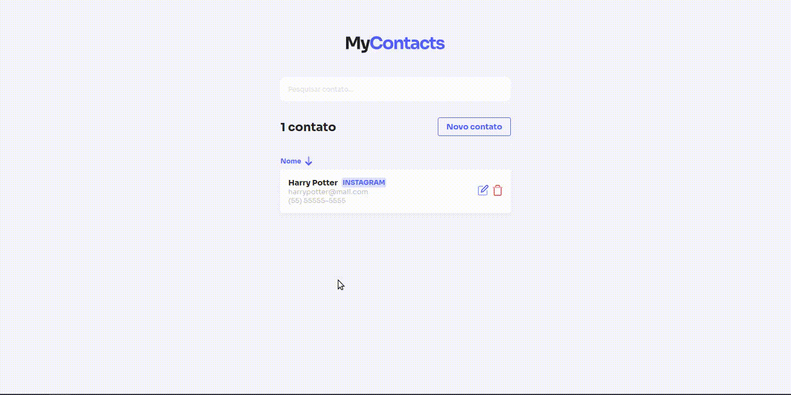

# 📱 MyContacts

MyContacts is an application to manage your contacts in a simple and easy way.


### 📜 Reference
The application was built on the [JStack](https://jstack.com.br/) course, a course focused on deep learning of JavaScript, NodeJS and ReactJS technologies.


### 🪓  Functionalities

- Contacts CRUD
- Categories CRUD


### 🚀 Demonstration of use



### ⚙️ How to run

Clone the project in your machine
```bash
  git clone git@github.com:nicolasteofilo/my-contacts.git
```

enter the project
```bash
  cd my-contacts
```

Install dependencies for the backend and frontend(with yarn or npm)
```bash
  cd api
  yarn install
```

```bash
  cd web
  yarn install
```

Database Settings

- Create a docker container with postgres
    - Use the following login credentials:
        - user: postgres
        - password: root
- Inside the container create a database called "mycontacts"
- Now, enter the database and run all the queries present in the file ***`my-contacts/api/src/database/schema.sql`***
- And finally run the container 😀

### 🧑 Authors

- [@nicolasteofilo](https://www.github.com/nicolasteofilo)

